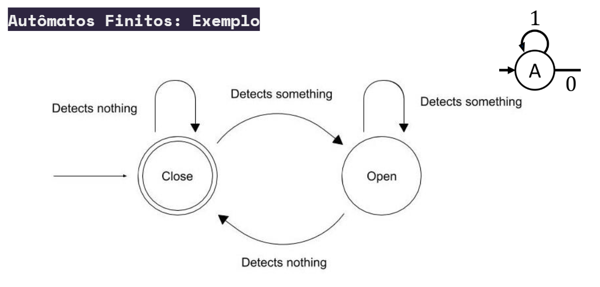
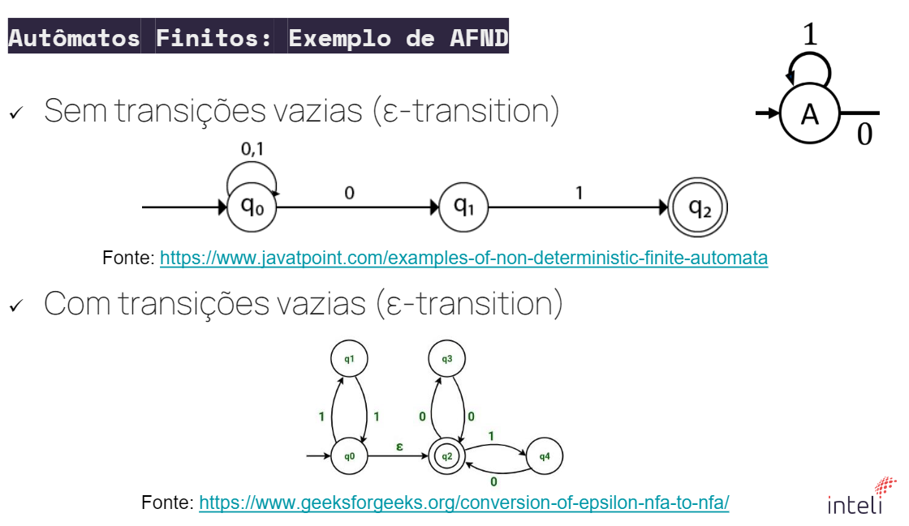
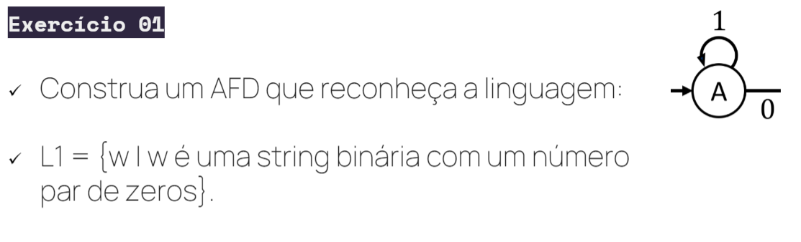
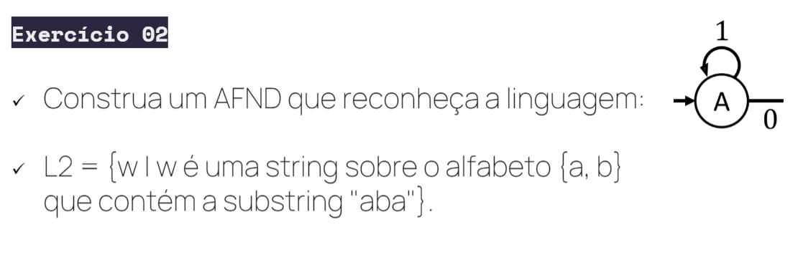
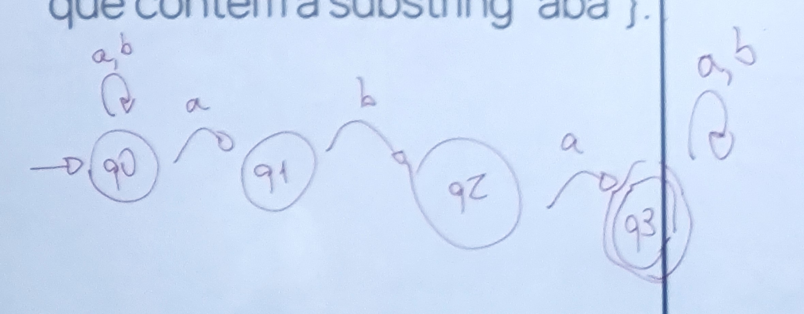
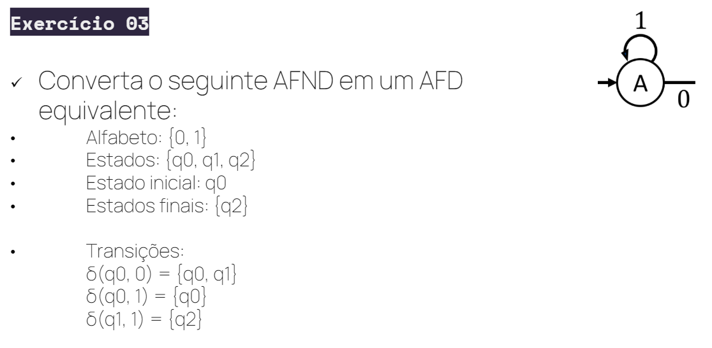
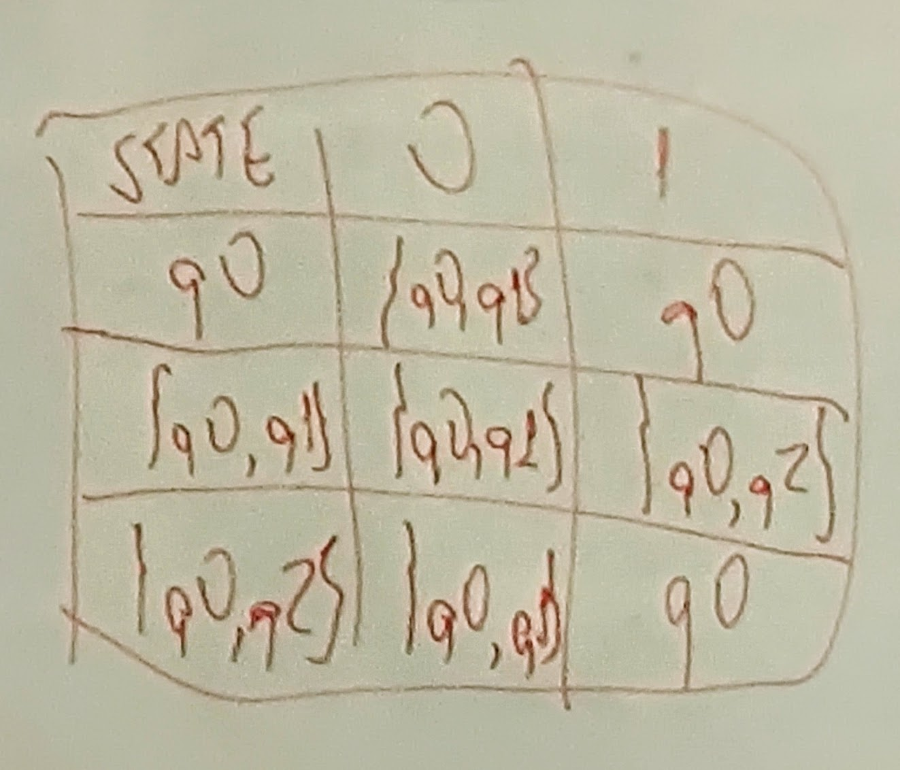
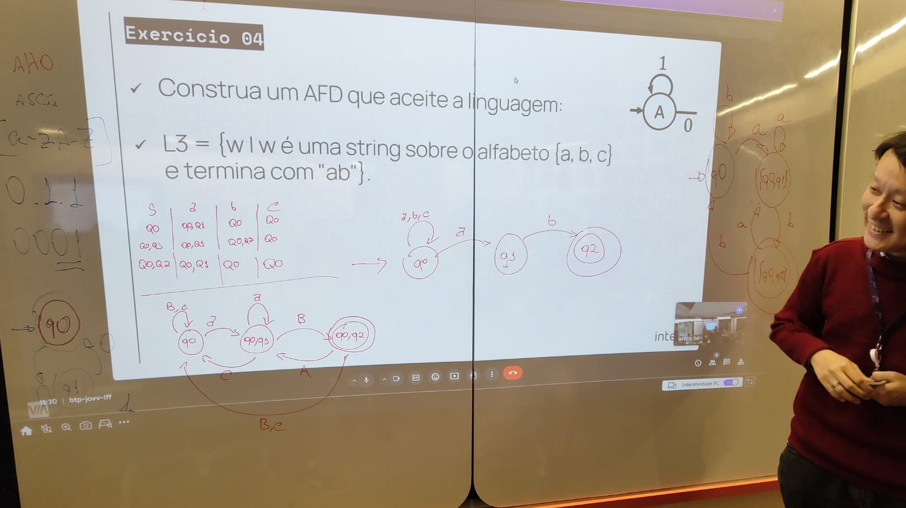
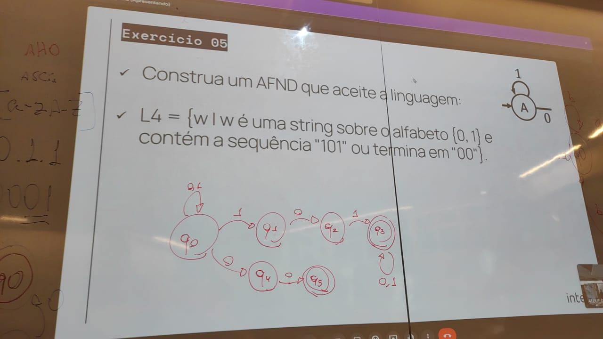

# Teoria da Computação

Autômatos são representações formais de máquinas de estado, usados para modelar sistemas com um número finito de estados e transições entre eles.

## Máquina de Estado Finito (Autômato Finito)

- **Teoria e Aplicações:**
    - Um autômato finito (ou máquina de estado finito) é um modelo matemático composto por um número finito de estados. Ele pode ser representado como um grafo dirigido com restrições, onde os nós representam estados e as arestas representam transições entre estados.
    - A máquina começa em um **estado inicial** e, com base nas **entradas** recebidas, realiza transições entre estados. Cada transição depende de uma entrada específica.
    - Ao contrário de um grafo comum, um autômato possui um estado inicial e pelo menos um **estado final** (ou estado de aceitação). Se a máquina termina no estado final após processar todas as entradas, dizemos que a entrada é **aceita**; caso contrário, ela é **rejeitada**.
    - Autômatos finitos são usados para representar **linguagens regulares**, ou seja, aquelas que podem ser descritas por expressões regulares (regex).
    - **Exemplos práticos:**
      - **Porta giratória automática**: Quando uma pessoa se aproxima, a porta entra no estado "aberta"; quando não há ninguém, ela retorna ao estado "fechada".
      - **Processamento de texto**: Encontrar palavras-chave em um documento.
      - **Compiladores**: Verificar se o código-fonte está escrito corretamente conforme as regras gramaticais da linguagem.
      - **Eletrônica digital**: Controlar o comportamento de circuitos digitais, como máquinas de estados em controladores.
      - **Jogos**: Criar a lógica de comportamento de NPCs (personagens não jogáveis) que reagem a diferentes estímulos.

    - **Estrutura**:
      - Cada círculo (ou bolha) representa um **estado**.
      - As **setas** representam as **transições** de um estado para outro, com base em uma entrada.
      - Um estado marcado com uma seta de entrada sem origem é o **estado inicial**.
      - Estados duplamente circulados são **estados finais** (ou de aceitação).
    
    - **Exemplo de Aplicação**:
      - Controle de semáforos, onde o sistema alterna entre os estados "Verde", "Amarelo", "Vermelho" de acordo com uma sequência temporal.
    
    

- **Tipos de Autômatos Finito:**
    - **Autômato Finito Determinístico (AFD)**:
      - A cada entrada, existe exatamente uma transição possível a ser seguida. Ou seja, para cada estado e entrada, há apenas um próximo estado definido.
      - **Características**:
        - Previsível e simples.
        - Usado quando se conhece precisamente o comportamento do sistema.
        - **Exemplo**: Autômato para validar senhas que seguem um padrão específico.
    - **Autômato Finito Não Determinístico (AFND)**:
      - Um estado pode ter várias transições para diferentes estados com base na mesma entrada. Ou seja, para uma entrada específica, o autômato pode seguir vários caminhos diferentes.
      - Embora pareça mais poderoso que o AFD, todo AFND pode ser convertido em um AFD equivalente.
      - **Características**:
        - Permite uma descrição mais compacta e flexível.
        - Usado em situações onde múltiplas soluções são possíveis.
        - **Exemplo**: Algoritmos de busca, como na exploração de múltiplos caminhos ao mesmo tempo.
    
    

- **Representações de Autômatos Finito:**
    - Autômatos podem ser representados de várias formas, incluindo:
      - **Tabelas de transições**: Mostram os estados e as transições baseadas em entradas.
      - **Diagramas de estados**: Um gráfico que descreve os estados e as transições (como os exemplos acima).
      - **Expressões regulares**: Para representar as linguagens aceitas por autômatos.
    
    - **Exemplo de tabela de transição**:
    
    | Estado Atual | Entrada | Próximo Estado |
    |--------------|---------|----------------|
    | S0           | a       | S1             |
    | S0           | b       | S2             |
    | S1           | a       | S0             |
    | S2           | b       | S1             |

- **Equivalência entre AFD e AFND:**
    - Embora os autômatos determinísticos e não determinísticos pareçam diferentes, é possível converter qualquer AFND em um AFD equivalente.
    - Esse processo envolve a criação de novos estados no AFD que representam conjuntos de estados do AFND.
    - A principal vantagem do AFND é a simplicidade na definição, enquanto o AFD é mais fácil de implementar em máquinas reais.

### Conclusão
Autômatos finitos são fundamentais para a compreensão de linguagens regulares e a construção de sistemas de software e hardware que reagem a entradas finitas. Além disso, a equivalência entre AFD e AFND demonstra a robustez dessas máquinas para modelar diversos tipos de problemas computacionais.

## Lista de Exercícios

R: Não peguei

R:

R:

