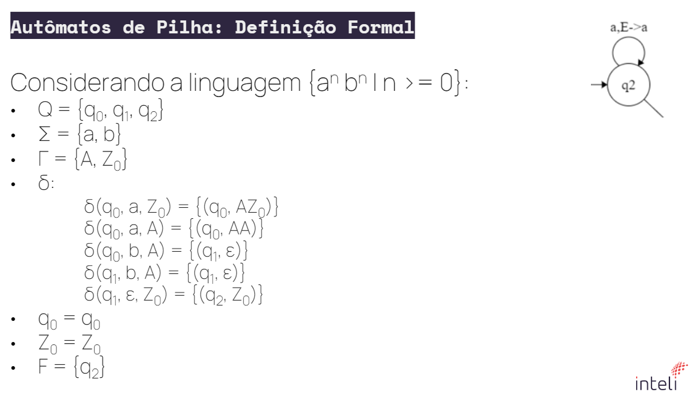

# Autômatos de Pilha

Os autômatos de pilha (PDA - *Pushdown Automata*) são uma extensão dos autômatos finitos, capazes de lidar com linguagens mais complexas do que as reconhecidas pelos autômatos de estado finito. A principal característica que os diferencia é a capacidade de utilizar uma pilha como uma forma de memória auxiliar, o que permite que resolvam problemas como o reconhecimento de palíndromos, uma tarefa impossível para autômatos finitos devido à sua memória limitada.

## Definição Formal
Um autômato de pilha é definido por uma 7-tupla:

**A = (Q, Σ, Γ, δ, q0, Z0, F)**, onde:

- **Q**: Conjunto finito de estados.
- **Σ**: Alfabeto de entrada (conjunto de símbolos que podem ser lidos pela máquina).
- **Γ**: Alfabeto da pilha (conjunto de símbolos que podem ser empilhados/desempilhados).
- **δ**: Função de transição *(Q × Σ × Γ → Q × Γ)*, que descreve as transições de estados com base na leitura do símbolo de entrada e no topo da pilha.
- **q0**: Estado inicial.
- **Z0**: Símbolo inicial da pilha.
- **F**: Conjunto de estados finais (estados de aceitação).

A função de transição δ controla o comportamento da pilha. Dependendo do símbolo lido da entrada e do símbolo no topo da pilha, o autômato pode empilhar ou desempilhar símbolos, além de mudar de estado.

### Funcionamento

- **Leitura**: A máquina lê um símbolo de entrada de Σ.
- **Manipulação da Pilha**: Com base no símbolo lido e no que está no topo da pilha, ela pode:
  - Empilhar um símbolo.
  - Desempilhar o topo.
  - Fazer uma transição de estado.
- **Aceitação**: O autômato aceita uma cadeia de entrada se, após consumir toda a entrada, ele estiver em um estado de aceitação e a pilha estiver vazia (ou algum outro critério for atendido, dependendo da variante).

### Exemplo Clássico: Reconhecimento de Palíndromos

Uma aplicação comum dos autômatos de pilha é o reconhecimento de **palíndromos**, que são palavras ou cadeias que podem ser lidas da mesma forma da esquerda para a direita e da direita para a esquerda. Para reconhecer um palíndromo, o autômato utiliza a pilha para "lembrar" a primeira metade da cadeia enquanto processa a segunda metade.

Por exemplo, para reconhecer a cadeia "radar", o autômato empilha os símbolos da primeira metade ("rad") e, quando chega à segunda metade, compara com o que está desempilhando, garantindo que a sequência seja simétrica.

## Tipos de Autômatos de Pilha

Existem duas variantes principais de autômatos de pilha:

1. **Autômato de Pilha Determinístico (DPDA)**: Em qualquer ponto, há no máximo uma transição válida a ser seguida. Estes são menos poderosos que os autômatos de pilha não determinísticos.
   
2. **Autômato de Pilha Não Determinístico (NPDA)**: Para qualquer símbolo lido e configuração da pilha, pode haver várias transições possíveis. Esse tipo de automato é mais poderoso e pode reconhecer todas as linguagens livres de contexto.

## Aplicações dos Autômatos de Pilha

Os autômatos de pilha são amplamente aplicados em várias áreas da ciência da computação, principalmente no **processamento de linguagens formais** e **compiladores**:

- **Análise Sintática**: Um dos principais usos dos autômatos de pilha é a análise de linguagens de programação, especialmente para a verificação de sintaxe. Eles são usados em parsers (*analisadores sintáticos*), onde verificam se uma sequência de tokens gerada por um analisador léxico segue as regras de uma gramática livre de contexto.
  
- **Linguagens Livres de Contexto (CFLs)**: Autômatos de pilha são utilizados para reconhecer linguagens livres de contexto, que são um conjunto de linguagens mais poderosas do que as linguagens regulares. Exemplos dessas linguagens incluem aritméticas, expressões e estruturas de controle de linguagens de programação.

- **Reconhecimento de Cadeias Palindrômicas**: Como mencionado anteriormente, autômatos de pilha são utilizados para reconhecer palíndromos, um exemplo de linguagem livre de contexto.

- **Interpretação de Gramáticas**: Linguagens com estruturas hierárquicas ou recursivas, como expressões matemáticas ou sentenças de linguagem natural, podem ser processadas por autômatos de pilha.

- **Compiladores**: Os autômatos de pilha são fundamentais na fase de análise sintática de compiladores, onde eles verificam a conformidade do código com a gramática de uma linguagem de programação.

## Limitações dos Autômatos de Pilha

Embora sejam mais poderosos que autômatos finitos, os autômatos de pilha não são tão poderosos quanto as **Máquinas de Turing**. Eles podem processar linguagens livres de contexto, mas não podem lidar com linguagens sensíveis ao contexto ou computações mais complexas que exigem maior controle de memória.

### Exemplos:

- 3 
  - Construa um APND que reconheça a linguagem:
  - L3 = {a^n b^2n | n >= 0} (Ou seja, o número de
  'b' é o dobro do número de 'a’).

- 4
  - Construa um APND que reconheça a linguagem:
  - L4 = {w ∈ {a, b}* | w possui o mesmo número de
'a's e 'b's}

