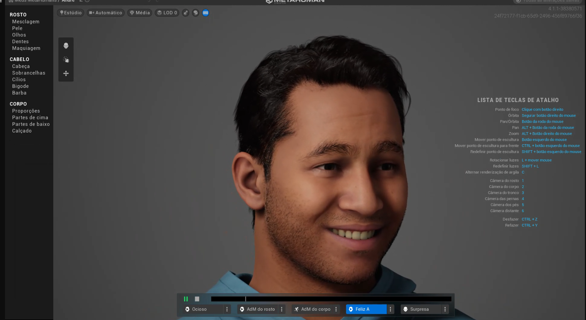
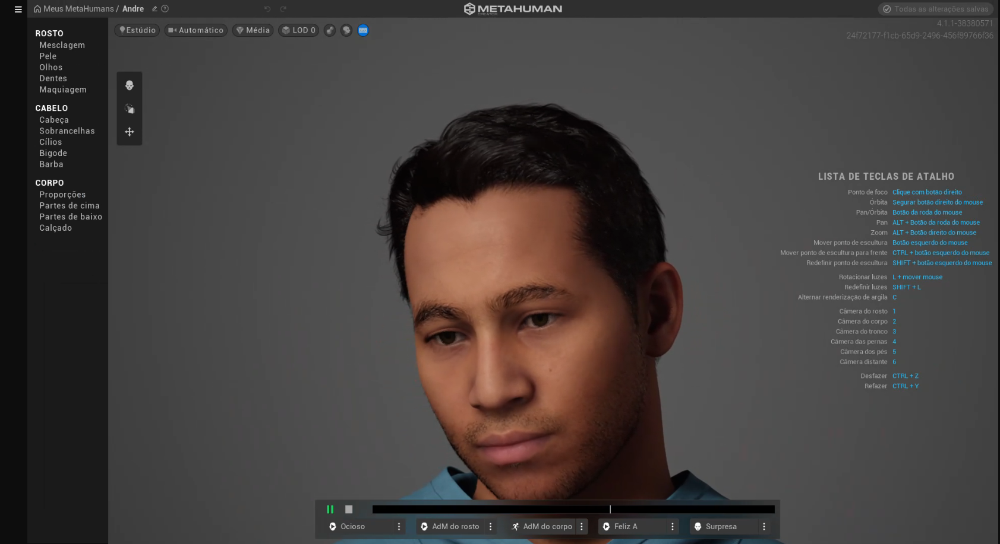

### **Criação de Humanos Virtuais em RV**

---

## **Introdução**
Esta documentação apresenta o processo detalhado de criação do humano digital **Prof. André**, desenvolvido para atuar como educador interativo em geografia em ambientes de realidade virtual (RV). O projeto foca na personalização visual, desenvolvimento de animações sincronizadas com narrações, e integração em dispositivos como **Meta Quest**, oferecendo uma experiência educacional imersiva e acessível.

---

## **Objetivos**
1. Criar um humano digital personalizado com design amigável e inclusivo.
2. Desenvolver narrações interativas sincronizadas com animações faciais.
3. Implementar o humano digital em cenários educacionais no **Unreal Engine**.
4. Testar e validar a funcionalidade em dispositivos de RV, como o **Meta Quest**.

---

## **Parte 1: Contextualização e Justificativa**

### **Propósito do Humano Digital**
O humano digital foi projetado para ser um **professor de geografia**, capaz de oferecer aulas interativas em salas de aula virtuais. Ele utiliza mapas, cenários tridimensionais e simulações naturais para engajar os alunos e tornar o aprendizado mais imersivo.

### **Descrição do Humano Digital**
- **Nome:** Prof. André  
- **Função:** Educador paciente e didático, responsável por guiar aulas em RV.  
- **Cenário de Uso:** Salas de aula virtuais acessíveis via dispositivos de RV como Meta Quest.  

### **Justificativa do Design**
Aparência e personalidade foram escolhidas para equilibrar autoridade e acolhimento:
- **Vestuário formal:** Camisa social azul e calça preta para transmitir profissionalismo sem intimidar.  
- **Óculos:** Associados à intelectualidade.  
- **Expressões amigáveis:** Promovem engajamento e conforto.  
- **Diversidade:** Tom de pele médio como representação inclusiva.  

Essas decisões foram fundamentadas em estudos sobre impacto visual em ambientes educacionais virtuais.

  

---

## **Parte 2: Criação no MetaHuman Creator**

### **Configurações Visuais**
O Prof. André foi criado no **MetaHuman Creator** com as seguintes características:
- **Tom de pele:** Médio, com detalhes naturais.  
- **Cabelo:** Curto, estilizado para refletir profissionalismo.  
- **Expressões faciais:** Configuradas para transmitir acessibilidade.  
- **Vestuário:** Camisa social azul clara e calça preta.  

### **Exportação**
O avatar foi exportado como o arquivo `Andre.mhb` para posterior integração no Unreal Engine.

### **Imagens**
  
  

---

## **Parte 3: Desenvolvimento de Narração**

### **Ferramenta Utilizada**
- **SpeechGen** ([speechgen.io](https://speechgen.io/pt/)): Gerador de texto para fala com vozes configuráveis.

### **Texto Narrativo**
O roteiro foi elaborado para ensinar sobre as cinco regiões do Brasil, com pausas estratégicas para fluidez.  

**Exemplo de texto:**  
*"Olá, eu sou o Professor André, e hoje vamos aprender algo muito importante sobre o nosso país: as cinco regiões do Brasil ... Vamos explorar juntos as diferenças e características de cada uma delas! ... Você sabia que o Brasil é dividido em cinco grandes regiões? ... Cada uma tem suas características próprias, como cultura, clima e economia. ... O Norte é a maior região, famosa por abrigar a Floresta Amazônica, o maior bioma do mundo! ... O Nordeste tem praias incríveis, é muito rico em cultura e história, e é o maior produtor de frutas tropicais do país. ... No Centro-Oeste, encontramos o Pantanal, a maior área alagada do planeta, e a capital do Brasil, Brasília! ... O Sudeste é a região mais populosa e industrializada do Brasil, com grandes cidades como São Paulo e Rio de Janeiro. ... E no Sul, temos um clima mais frio e paisagens lindas, como as serras gaúchas e catarinenses. ... E aí, gostaram dessa viagem pelo Brasil? ... Agora vocês já sabem um pouco mais sobre as nossas regiões e suas riquezas. ... Até a próxima aula!"*

### **Processo**
1. **Criação do texto:** Desenvolvido para garantir clareza e fluidez.  
2. **Configuração de voz:** Escolhida uma voz masculina amigável e didática.  
3. **Exportação:** Áudio gerado em formato `.mp3` para integração.  

### **Sincronização**
O áudio será sincronizado com as animações labiais e gestuais no Unreal Engine para proporcionar uma experiência natural e imersiva.

---

## **Parte 4: Integração no Unreal Engine** (TODO)

### **Etapas**
1. **Importação do Avatar:**  
   - O arquivo `Andre.mhb` foi carregado no Unreal Engine.  
   - Configurações adicionais foram aplicadas para animações labiais e gestuais.  
2. **Sincronização de Áudio:**  
   - O áudio narrativo foi integrado diretamente ao avatar.  
3. **Criação de Cenário Virtual:**  
   - Sala de aula virtual com mapas interativos e simulações 3D.  
4. **Testes de Funcionalidade:**  
   - Validação em dispositivos Meta Quest para ajustes finais.  

---

## **Parte 5: Testes e Deploy** (TODO)

### **Dispositivo Utilizado**
- **Meta Quest:** Plataforma utilizada para validação e testes de usabilidade.

### **Testes Realizados**
1. **Compatibilidade:** Garantir que avatar, áudio e cenário funcionam em conjunto.  
2. **Engajamento:** Avaliar feedback sobre interatividade e qualidade.  
3. **Desempenho:** Certificar-se de que a experiência é fluida e responsiva.  

---

## **Ferramentas Utilizadas**
- **MetaHuman Creator:** Personalização do avatar.  
- **SpeechGen:** Geração de áudio narrativo.  
- **Unreal Engine:** Integração e desenvolvimento do cenário virtual.  
- **Meta Quest:** Dispositivo de teste e validação.  

---

## **Conclusão**
O humano digital **Prof. André** foi desenvolvido com sucesso como um professor de geografia para ambientes virtuais. Ele combina personalização visual, narração sincronizada e interação fluida em cenários educacionais. As próximas etapas incluem a finalização da integração no Unreal Engine e validação em dispositivos Meta Quest para garantir uma experiência educacional completa.

