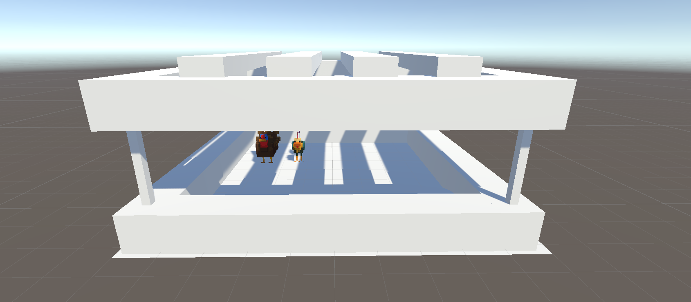
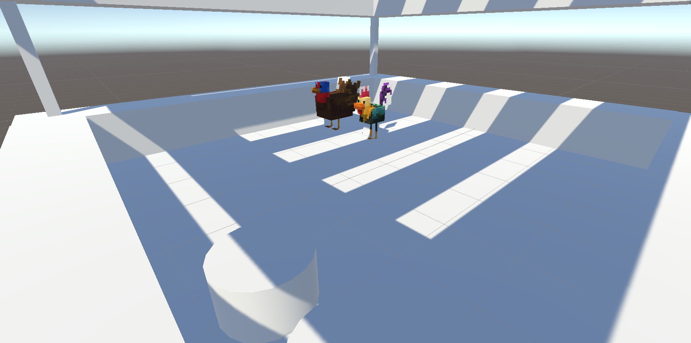
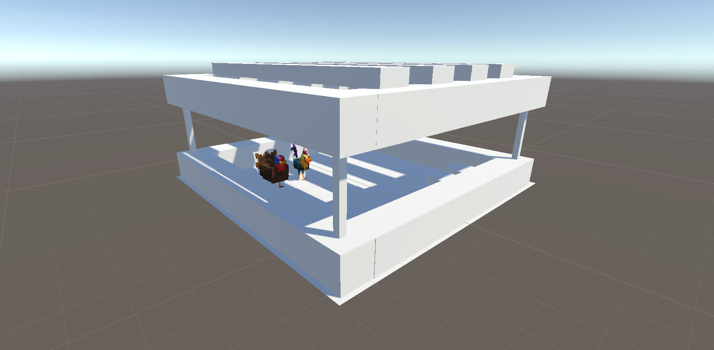

# Modelo 3D de um Celerinho no Unity

## 1. Introdução

O projeto foi desenvolvido com o objetivo de criar um modelo 3D interativo de um **celeiro**, utilizado para simulações, jogos ou experiências de realidade virtual. A escolha deste tema foi motivada pelo interesse em recriar estruturas arquitetônicas simples e funcionais que possam ser adaptadas para diferentes contextos.

### Objetivos
- Recriar um modelo realista de um celerinho com funcionalidades básicas.
- Adicionar elementos interativos, como personagens, para enriquecer o ambiente virtual.
- Aprender e explorar o uso do Unity para modelagem 3D e construção de ambientes.

---

## 2. Justificativa das Escolhas

A estrutura foi projetada com foco em simplicidade e funcionalidade, refletindo as características de um celerinho típico. As decisões foram baseadas nos seguintes pontos:

1. **Modelo Arquitetônico Simples:**  
   O design escolhido apresenta um estilo minimalista que permite fácil adaptação para outros projetos, como jogos ou treinamentos.

2. **Elementos Animados:**  
   Foram incluídas duas figuras interativas de animais (uma galinha e um peru), disponíveis gratuitamente no Sketchfab, para adicionar vida e contexto ao ambiente.

3. **Uso do Unity:**  
   A escolha da Unity foi motivada pela flexibilidade oferecida para criar e modificar o ambiente, bem como pela ampla gama de recursos para interatividade e renderização.

4. **Iluminação e Sombra:**  
   A iluminação foi configurada para enfatizar as características dos modelos, criando um contraste claro que destaca as sombras geradas pelos elementos superiores da estrutura.

---

## 3. Enredo do Projeto

O enredo imaginado para o celerinho envolve uma simulação onde os animais são os protagonistas. A ideia central é retratar um pequeno ambiente rural onde os animais estão protegidos por uma estrutura simplificada. Este cenário pode ser utilizado em jogos educativos ou simuladores que exploram temas de agroecologia e sustentabilidade.

---

## 4. Recursos Utilizados

### 4.1. Modelos 3D
- **Modelo de Peru:**  
  Link para download: [Turkey (Sketchfab)](https://sketchfab.com/3d-models/turkey-aa8e8bc39e8a45d1a881587430096967)

- **Modelo de Galinha:**  
  Link para download: [Chicken (Sketchfab)](https://sketchfab.com/3d-models/chiken-f736d71135ab4ee1b9e90fffa9c7c5e4)

### 4.2. Software
- **Unity** para modelagem e renderização do ambiente.

---

## 5. Estrutura do Modelo

### 5.1. Partes Principais
1. **Base:**  
   Uma plataforma sólida que serve como o chão da estrutura.

2. **Pilares:**  
   Suportam a cobertura superior e ajudam a manter o equilíbrio visual do modelo.

3. **Cobertura:**  
   Projetada com ripas para criar uma sombra parcial, permitindo a entrada de luz.

### 5.2. Elementos Complementares
- **Figuras de Animais:**  
  Adicionados como pontos focais no ambiente para aumentar o realismo.

---

## 6. Imagens

### Vista Geral do Modelo

### Detalhe 1: Animais na Plataforma  

### Detalhe 2: Iluminação e Sombras  

---

## 7. Conclusão

Este projeto demonstra a possibilidade de criar um ambiente simples e funcional utilizando o Unity. A introdução de elementos interativos, como os modelos de animais, acrescenta profundidade e engajamento ao cenário. No futuro, o modelo poderá ser expandido para incluir funcionalidades adicionais, como animações e interatividade.