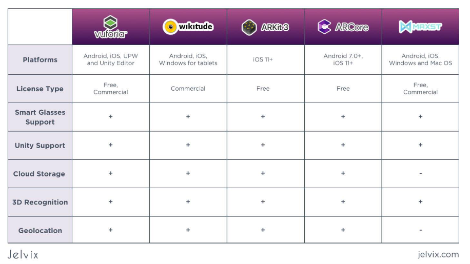

# **Documentação sobre Realidade Ampliada (RA)**

Diante das opções, vamos de MAXST, única que roda no MAC.



## **1. Introdução à Realidade Ampliada (RA)**

### **1.1 O que é RA?**
A Realidade Ampliada (RA) é uma tecnologia que combina elementos do mundo real com objetos virtuais, sobrepondo gráficos, sons e outros estímulos sensoriais ao ambiente físico. O conceito foi introduzido em 1992 por Thomas Preston Caudell, enquanto Paul Milgram e Fumio Kishino teorizaram o "continuum real-virtual", que descreve a transição gradual do real para o virtual.

#### **Exemplos de Aplicações:**
- **Educação**: Simulações de fenômenos científicos ou históricos.
- **Saúde**: Treinamentos cirúrgicos e diagnósticos assistidos.
- **Entretenimento**: Jogos interativos e experiências imersivas.

---

### **1.2 Características da RA**
1. **Integração Real-Virtual**: Objetos digitais são integrados ao ambiente físico, mantendo coerência visual.
2. **Interatividade**: Usuários podem interagir com os elementos virtuais em tempo real.
3. **Imersão**: A experiência é projetada para parecer natural e envolvente.
4. **Acessibilidade**: Dispositivos como smartphones e navegadores permitem o acesso à RA sem hardware especializado.

---

## **2. Ferramentas e Tecnologias**

### **2.1 Diferença entre Frameworks e Bibliotecas**
- **Frameworks**:
  - Estruturas completas que definem padrões e controlam o fluxo do programa.
  - Exemplos: **A-Frame**, **Unity com Vuforia**, **React 360**.
- **Bibliotecas**:
  - Conjuntos de funcionalidades reutilizáveis, onde o desenvolvedor tem controle total sobre a implementação.
  - Exemplos: **Three.js**, **WebXR API**.

---

### **2.2 Ferramentas Aprendidas**

#### **A-Frame (Framework)**
- **Descrição**: Um framework baseado em HTML e WebGL para criar experiências 3D e de RA de forma simples e declarativa.
- **Características**:
  - Componentes HTML (`<a-box>`, `<a-sphere>`) facilitam a criação de objetos.
  - Suporte nativo a dispositivos RA e VR através da API WebXR.
  - Alta acessibilidade para prototipagem rápida.
- **Aplicações**:
  - Desenvolver tours virtuais, simulações e experiências interativas.
  - Combinação com AR.js para integrar objetos digitais ao mundo real.

---

#### **AR.js (Biblioteca)**

- **Descrição**: Extensão para A-Frame que adiciona suporte direto a RA no navegador.
- **Características**:
  - Suporta detecção de marcadores (como `hiro`) e âncoras para objetos 3D.
  - Funciona em navegadores modernos sem instalação adicional.
  - Rápida implementação para projetos experimentais.
- **Aplicações**:
  - Ancorar objetos 3D em espaços físicos usando padrões visuais.
  - Prototipar aplicações educacionais e interativas de RA.

---

#### **WebXR API (Biblioteca)**

- **Descrição**: Uma API JavaScript que permite criar experiências RA e VR personalizadas em navegadores compatíveis.
- **Características**:
  - Acesso direto a sensores e dados espaciais do dispositivo.
  - Suporte para múltiplas plataformas e dispositivos RA/VR.
- **Aplicações**:
  - Construir experiências imersivas personalizadas.
  - Integração de interfaces adaptativas a dispositivos específicos.

---

## Ferramentas e Tecnologias**

### **2.3 Ferramentas Não Aprendidas**

#### **Three.js (Biblioteca)**
- **Descrição**: Uma biblioteca JavaScript de alto desempenho para renderização 3D baseada em WebGL.
- **Características**:
  - Suporte avançado para animações, shaders personalizados e física.
  - Permite maior controle sobre cenas, luzes e câmeras.
  - Exige maior conhecimento técnico comparado a frameworks mais declarativos como A-Frame.
- **Aplicações**:
  - Criação de simulações científicas detalhadas.
  - Desenvolvimento de experiências 3D avançadas e customizáveis.

---

#### **Unity com Vuforia (Framework)**
- **Descrição**: Uma combinação do motor Unity com a biblioteca Vuforia, projetada para aplicações de RA robustas.
- **Características**:
  - Suporte para reconhecimento de objetos, planos e imagens em alta precisão.
  - Compatibilidade com dispositivos móveis e óculos de RA.
  - Ferramentas visuais simplificam o desenvolvimento para iniciantes.
- **Aplicações**:
  - Treinamentos industriais.
  - Aplicativos móveis de RA baseados em reconhecimento de objetos.

---

#### **React 360 (Framework)**
- **Descrição**: Framework baseado no React para criação de experiências VR/RA interativas e focadas em ambientes web.
- **Características**:
  - Facilita a integração com ecossistemas baseados em React.
  - Permite criar tours virtuais em 360°.
- **Aplicações**:
  - Desenvolvimento de experiências educativas ou interativas com foco em acessibilidade via navegador.

---

### **2.4 Tabela Comparativa**

| Ferramenta       | Tipo        | Complexidade | Foco Principal                | Ideal Para                                   |
|-------------------|-------------|--------------|--------------------------------|---------------------------------------------|
| **A-Frame**       | Framework   | Baixa        | Criação de cenas 3D rápidas   | Prototipagem de RA e VR                     |
| **AR.js**         | Biblioteca  | Baixa        | Integração de RA no navegador | Prototipagem rápida com marcadores          |
| **WebXR API**     | Biblioteca  | Média        | RA e VR customizados          | Controle total de RA e VR                   |
| **Three.js**      | Biblioteca  | Alta         | Renderização 3D detalhada     | Experiências avançadas e altamente customizáveis |
| **Unity + Vuforia**| Framework  | Alta         | Desenvolvimento robusto        | Aplicações móveis e industriais de RA       |
| **React 360**     | Framework   | Média        | Integração web                 | Experiências web interativas e tours 360    |

---

## **3. Exemplos Práticos e Análise**

### **3.1 Cena Básica em A-Frame**
```html
<!DOCTYPE html>
<html>
  <head>
    <script src="https://aframe.io/releases/1.2.0/aframe.min.js"></script>
  </head>
  <body>
    <a-scene>
      <a-box position="0 1 -5" rotation="0 45 0" color="#4CC3D9"></a-box>
      <a-sphere position="2 1 -3" radius="1.25" color="#EF2D5E"></a-sphere>
      <a-light type="point" intensity="1" position="2 4 -3"></a-light>
      <a-plane position="0 0 -4" rotation="-90 0 0" width="4" height="4" color="#7BC8A4"></a-plane>
    </a-scene>
  </body>
</html>
```

#### **Análise**
- **`<a-scene>`**: Define a cena principal onde os elementos 3D são renderizados.
- **Primitivas (`<a-box>`, `<a-sphere>`)**: Elementos básicos para construir formas geométricas na cena.
- **`<a-light>`**: Adiciona iluminação, essencial para criar um ambiente realista.

---

### **3.2 RA com Marcadores usando AR.js**
```html
<!DOCTYPE html>
<html>
  <head>
    <script src="https://aframe.io/releases/1.2.0/aframe.min.js"></script>
    <script src="https://cdn.jsdelivr.net/npm/aframe-ar.js"></script>
  </head>
  <body>
    <a-scene embedded arjs>
      <a-marker preset="hiro">
        <a-box position="0 0.5 0" material="color: red;"></a-box>
      </a-marker>
      <a-entity camera></a-entity>
    </a-scene>
  </body>
</html>
```

#### **Análise**
- **`arjs`**: Ativa o suporte à RA na cena.
- **`<a-marker>`**: Usado para detectar padrões (ex.: `hiro`) e posicionar objetos digitais no espaço físico.

---

### **3.3 Projeção Equiretangular com A-Frame**
```html
<!DOCTYPE html>
<html>
  <head>
    <script src="https://aframe.io/releases/1.2.0/aframe.min.js"></script>
  </head>
  <body>
    <a-scene>
      <a-sky src="path-to-360-image.jpg"></a-sky>
    </a-scene>
  </body>
</html>
```

#### **Análise**
- **`<a-sky>`**: Cria uma projeção esférica que permite experiências imersivas em 360°, ideal para tours virtuais.

---

## **4. Aplicações e Considerações Finais**

- **Educação**: Simulações de ciências e história para engajar alunos.
- **Saúde**: Treinamento médico e RA para diagnósticos.
- **Entretenimento**: Experiências de jogos e narrativas imersivas.
- **Turismo**: Tours virtuais para explorar locais remotos.

**Próximos Passos**:
- Testar bibliotecas avançadas como **Three.js**.
- Criar um projeto completo de RA usando Unity com Vuforia.
- Integrar soluções de IA para reconhecimento de objetos em tempo real.