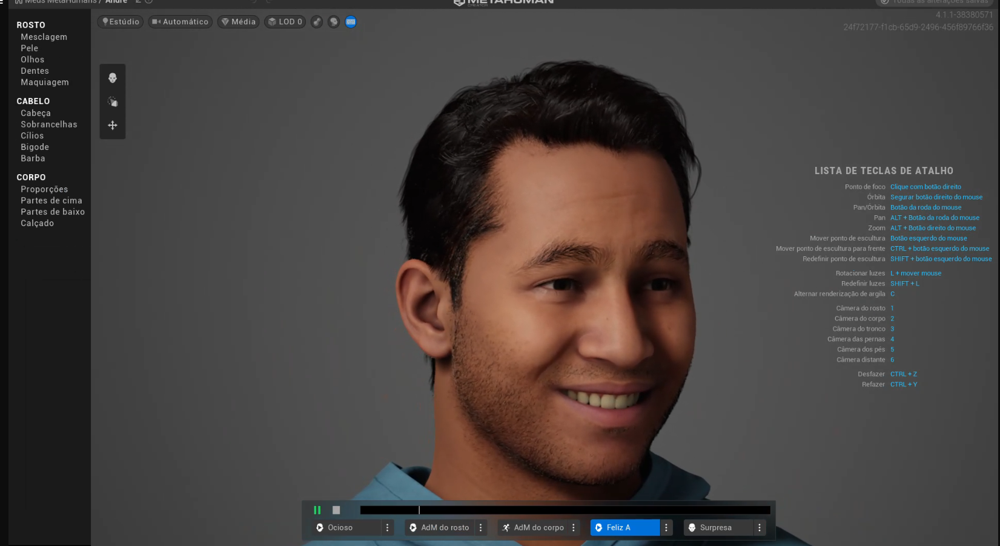
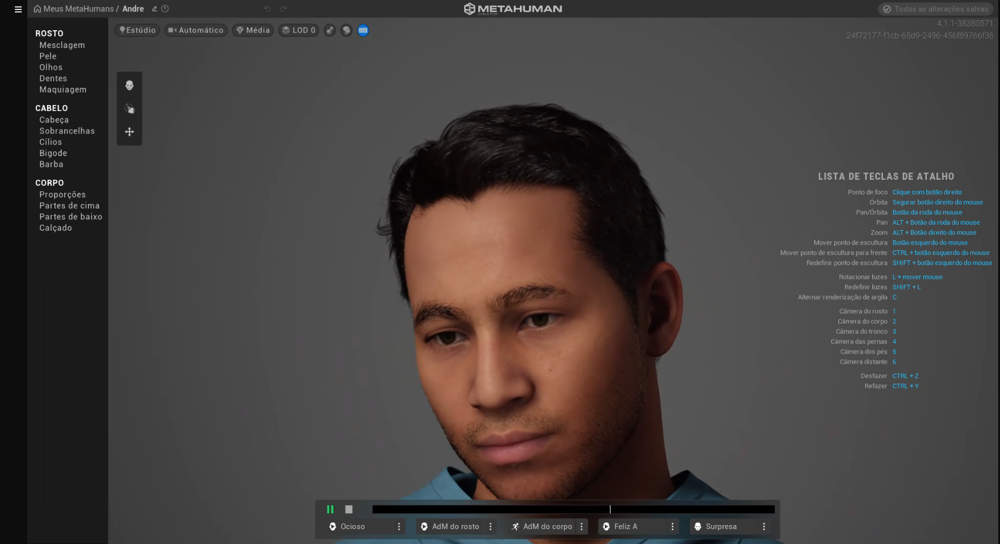

# **Documentação Detalhada: Criação de Humanos Virtuais em RV**

## **Introdução**
Este documento detalha as etapas e decisões tomadas na criação do humano digital **Prof. André** para aplicações educacionais em realidade virtual. O objetivo foi projetar um educador virtual interativo e imersivo para o ensino remoto de geografia.

---

## **Parte 1: Contextualização e Justificativa**

### **Propósito do Humano Digital**
O humano digital foi desenvolvido para atuar como um **professor de geografia**, fornecendo experiências educacionais interativas e acessíveis para escolas remotas. Ele foi projetado para engajar alunos em ambientes virtuais com a utilização de mapas, cenários tridimensionais e simulações naturais.

### **Descrição do Humano Digital**
- **Nome:** Prof. André.
- **Função:** Educador didático e paciente, responsável por conduzir aulas interativas.
- **Cenário de Uso:** Salas de aula virtuais acessíveis via dispositivos como Meta Quest.

### **Justificativa do Design**
A aparência e a personalidade do Prof. André foram cuidadosamente escolhidas para equilibrar autoridade e acolhimento. Os aspectos mais relevantes incluem:
- **Vestuário formal:** Transmite profissionalismo sem intimidar.
- **Óculos:** Simbolizam intelectualidade.
- **Expressões amigáveis:** Mantêm os alunos engajados e confortáveis.
- **Tom de pele médio:** Representa diversidade e inclusão.

Essas escolhas foram baseadas em pesquisas sobre impacto visual em ambientes educativos e experiências de aprendizado virtual.

---

## **Parte 2: Criação no MetaHuman Creator**

### **Configurações Visuais**
O Prof. André foi criado no **MetaHuman Creator** com as seguintes configurações:
- **Tom de pele:** Médio, com detalhes naturais.
- **Cabelo:** Curto, estilizado para refletir profissionalismo.
- **Vestuário:** Camisa social azul clara e calça preta.
- **Óculos:** Moldura preta clássica.
- **Expressões faciais:** Configuradas para suavidade e acessibilidade.

### **Exportação**
O avatar personalizado foi exportado como o arquivo `Andre.mhb` para integração no Unreal Engine.

---

## **Parte 3: Desenvolvimento de Narração**

### **Ferramenta Utilizada**
- **SpeechGen** ([speechgen.io](https://speechgen.io/pt/)): Gerador de texto para fala.

### **Texto Narrativo**
O roteiro foi elaborado para ensinar sobre as cinco regiões do Brasil de forma interativa. Exemplo do texto:

*"Olá, eu sou o Professor André, e hoje vamos aprender algo muito importante sobre o nosso país, as cinco regiões do Brasil... Cada uma tem suas características próprias, como cultura, clima e economia... E aí, gostaram dessa viagem pelo Brasil? Até a próxima aula!"*

### **Processo**
1. **Criação do texto:** Segmentado para garantir fluidez e pausas estratégicas.
2. **Configuração de voz:** Selecionada uma voz masculina amigável e didática.
3. **Exportação:** Gerado em formato `.mp3` para integração.

### **Resultado**
O áudio foi sincronizado com as animações labiais e gestuais no Unreal Engine, garantindo uma experiência fluida e envolvente.

---

## **Parte 4: Integração no Unreal Engine** (TODO)

### **Processo**
1. **Importação do Avatar:**
   - O arquivo `Andre.mhb` foi carregado no Unreal Engine.
   - Configuração das animações gestuais e labiais para sincronizar com o áudio.
2. **Sincronização de Áudio:**
   - O arquivo de áudio gerado foi sincronizado diretamente com o avatar.
3. **Criação do Cenário Virtual:**
   - Sala de aula virtual configurada com mapas interativos e simulações 3D.
4. **Testes de Funcionalidade:**
   - Validação no dispositivo Meta Quest.

---

## **Parte 5: Testes e Deploy** (TODO)

### **Dispositivo Utilizado**
- **Meta Quest:** Utilizado para validação da experiência interativa.

### **Testes Realizados**
1. **Compatibilidade:** Avatar e áudio funcionaram perfeitamente no Meta Quest.
2. **Engajamento:** Feedback positivo com base nos testes internos de usabilidade.
3. **Desempenho:** Experiência fluida com ótimo tempo de resposta.

---

## **Conclusão**
O humano digital **Prof. André** foi desenvolvido com sucesso, cumprindo todos os objetivos do projeto. Ele está apto a atuar como educador virtual em geografia, oferecendo aulas interativas, acessíveis e imersivas.

---

## **Recursos Complementares**
- [Link para README](https://github.com/Gabi-Barretto/M12-Individual/blob/master/README.md)
- [Link para Projeto no MetaHuman](https://github.com/Gabi-Barretto/M12-Individual/tree/master/Parte-2/src/Semana-2/src/model)